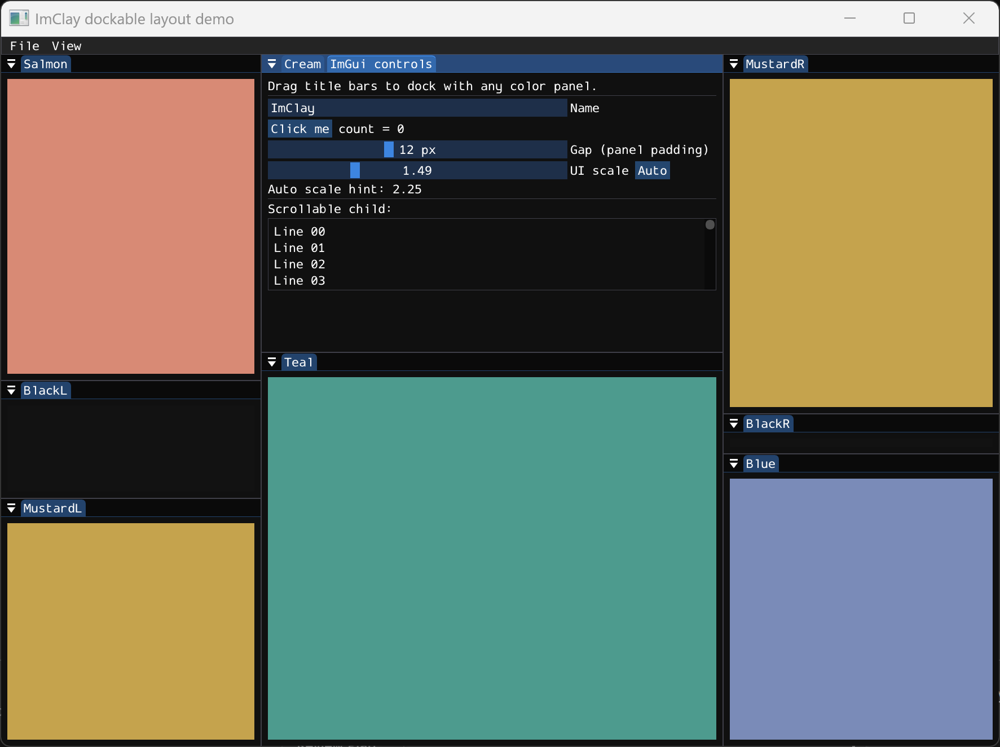

# ImClay

Clay flex layout rendered into **Dear ImGui** `ImDrawList`.



| Layer | Role |
|-------|------|
| [Clay](https://github.com/nicbarker/clay) (`libs/clay/clay.h`) | Layout (flex, scroll, grow/fixed) |
| **ImClay** | `MeasureText` via `ImFont`, `Render` → `ImDrawList` |
| Dear ImGui | Fonts, input, docking, widgets |

## Repo layout

```
include/ImClay/     Public API
src/ImClay.cpp      Clay → ImDrawList renderer
libs/clay/          Vendored Clay header
```

## Usage

```cpp
#include "ImClay/ImClay.h"
#include "clay.h"
#include "imgui.h"

ImClay::Context ctx;
ImClay::Init(ctx, width, height);

ImClay::FontSlot font { io.Fonts->Fonts[0], 16.f };
ImClay::SetMeasureFonts(ctx, &font, 1);

ImClay::SetLayoutDimensions(ctx, width, height);
ImClay::BeginLayout(ctx);
CLAY({ /* ... */ }) { CLAY_TEXT(CLAY_STRING("Hello"), { .fontSize = 24 }); }
Clay_RenderCommandArray cmds = ImClay::EndLayout(ctx, io.DeltaTime);
ImClay::Render(cmds, ImGui::GetWindowDrawList(), &font, 1, ImGui::GetCursorScreenPos());
```

After `ImGui::NewFrame()`, refresh the font slot from `io.Fonts->Fonts[0]` if you scale UI or rebuild the atlas.

## Licence

ImClay: MIT. Clay and Dear ImGui use their own licences.
